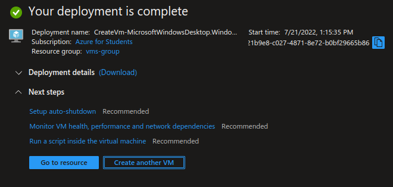
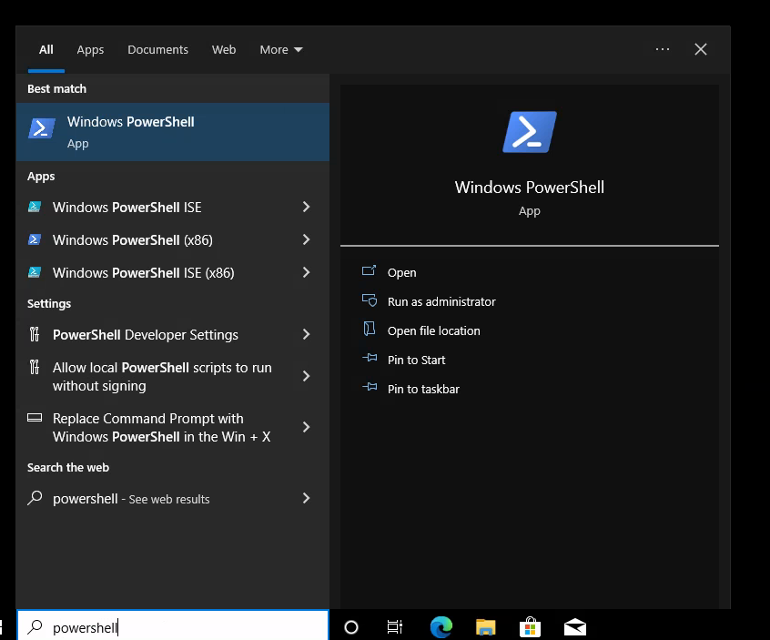

# Connecting two VMs using a Virtual Network via the Azure Portal

---------------------------------------------------------

## Requirements
- Microsoft Azure Account ( with funds or credits )
- Microsoft Azure Suscription
- A web browser
- Access to internet

---------------------------------------------------------

## Instructions
#### 1. Login to the [Azure Portal](https://portal.azure.com/).
#### 2. Once you're on the portal's home page, you will see something like this:

#### 3. Inside the search bar (located at the top), look for *virtual machines* and click on it.

#### 4. Click on *Create* and then *Azure virtual machine*.

#### 5. First, you'll need to select or create a resource group. I will be creating one be by clicking *Create new*

#### 6. Now, you have to configure the first virtual machine's details: name, region, operating system (image) and size are mandatory, the rest are optional.

#### 7. You will also need to configure the administrator account for this VM; just give it a name and a password.

#### 8. If you chose Windows as your OS, confirm that you have the licensing to use it by checking the box at the bottom of the basics tab.

#### 9. Go to the *Networking* tab (ths menu  is available at the top side of the page).

#### 10. Check that every option inside the network interface configuration is similar to the one below.

#### 10. You can configure the rest of the VM's details if you want. When you're ready click *Review + create*.

#### 11. If validation passed, click *Create*.

#### 12. Deployment will begin. Please wait until it's over.

#### 13. Once deployment has been completed, click on *Create another VM*.

#### 14. Now, configure the other VM's details.

#### 15. Go to the *Networking* tab and make sure you have the same virtual network and disable the network security group. Then review and create it.

#### 16. Wait for deployment to complete.

#### 17. Once deployment has completed, go ot your resource group. 

#### 18. Click inside one of your VMs and connect to it using your favorite RDP connection app (like [Windows Remote Desktop](https://www.microsoft.com/store/apps/9wzdncrfj3ps)).

#### 19. If this appears inside your VM's desktop, click yes.

#### 20. Inside your VM, open Powershell as administrator inside your VM by clicking on the windows icon on the bottom left of the VM's screen and typing *powershell* and then clicking *Run as administrator*.

#### 21. Type *ipconfig* and press enter. This will give you your VM's IP.

#### 22. Go back the Azure Portal using your main PC, then, go back your resource group and click on your virtual network.

#### 23. On the left side, click on *Connected devices*, you will see both of your VMs. Identify which one you did not connect to using the IP addresses.

#### 24. Inside your VM, type *mstsc /v:(your other VM's ip)* to connect to it.

#### 25. Insert your other VM's credentials, then ok, then yes  .

#### 26. You will now be using a remote VM inside a remote VM, congratulations!

---------------------------------------------------------

## Congratulations ! You've just connected two VMs inside a virtual network !
Don't forget to delete or pause all of your resources! If you don't, it will be very expensive.